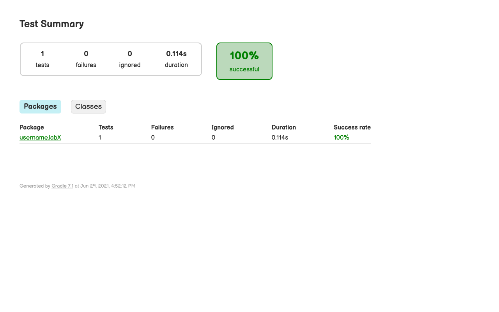
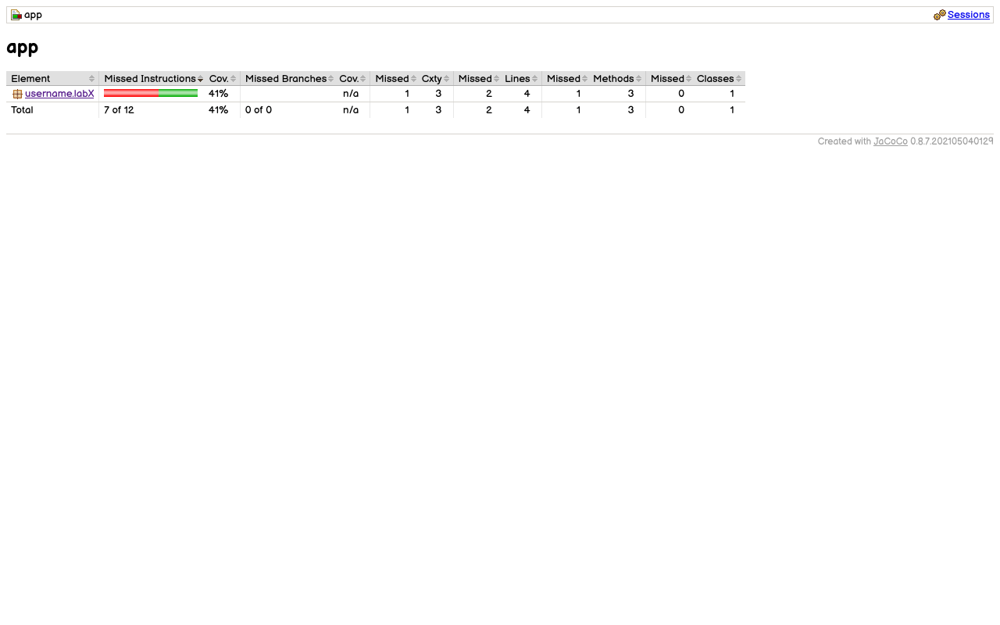
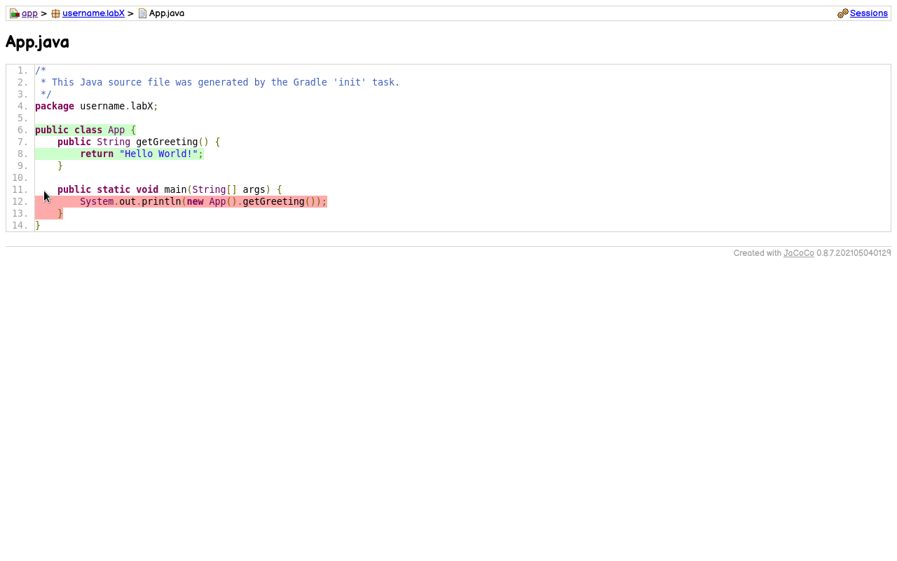

# Lab X

Lab description goes here...

## Getting Started

After cloning this *git* repository, there are two ways to run the application. Either by installing *gradle* on the system:
- `gradle run`

or by running already prepared scirpts as below:
- `./gradlew run`           *Linux/Mac*
- `./gradlew.bat run`       *Windows*

### Prerequisites

- [Git (latest release)](https://git-scm.com/)
- [Gradle (latest release)](https://gradle.org/)
- [Java SE 8+](https://docs.oracle.com/en/java/javase/)

### Running the application

By issuing `gradle run`, *gradle* will automatically install all the dependencies declared in `./app/build.gradle` file:
```groovy
dependencies {
    ...
}
```
compile the source code located at `./app/src/main/java/`, build and execute the application.

## Running the tests

**TODO** Implement and describe your own custom [JUnit](https://junit.org/junit5/) tests. *(quality over quantity)* *(code coverage > 60%)*

```java
/**
* Genererates input data sets for the test method
* with the same name.
*
* @return stream of data sets
*/
private static Stream<Arguments> testDivisionByZero() {
    return Stream.of(
      Arguments.of(1, 0),
      Arguments.of(1, 1 - 1d),
      Arguments.of(1, ( 1 / 2d ) - ( 1 / 2d )),
      Arguments.of(1, ( 1 / 3d ) - ( 1 / 3d ))
    );
}

@ParameterizedTest
@MethodSource
public void testDivisionByZero(double a, double b) {
    assertThrows(ArithmeticException.class, () => {
        SomeClass.divide(a, b);
    });
}
```

The automated tests located at `./app/src/test/java/` can be run by issuing `gradle test`. Afterwards, the outcome reports (tests and code coverage) will be available in `./app/build/reports/tests/test/index.html` and `./app/build/reports/jacoco/test/html/index.html` files respectively. Open a web browser to see the content:




Additionally, the source code can be linted by issuing `gradle check`. This may be helpful in eliminating bugs and/or improving code quality. The final report will be available in `./app/build/reports/checkstyle/main.html` file.

## Generating the documentation

**TODO** Each class and method should have a comment.

```java
/**
* Returns a quotient of two numbers.
* <p>
* If the second argument is zero, an instance
* of <code>ArithmeticException</code> is thrown.
*
* @param  a  dividend
* @param  b  divisor
* @return    quotient
* @throws ArithmeticException while dividing by zero
*/
public static double divide(double a, double b) {
    if (b == 0) throw new ArithmeticException("division by zero");
    return a / b;
}
```

The API documentation can be generated by issuing `gradle javadoc`. Afterwards, the outcome will be available in `./app/build/docs/javadoc/index.html` file that can be viewed in a web browser.

## Contributors

  - **John Doe** (*username@kth.se*)

## License

MIT
